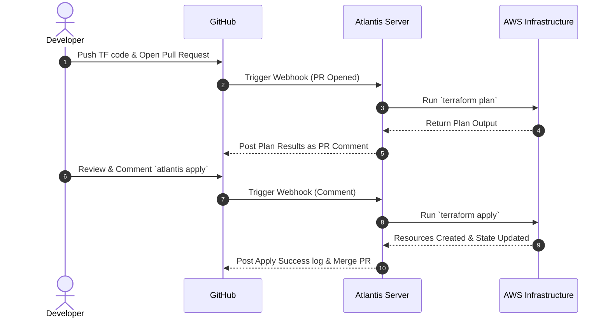

# Atlantis Local Testing Guide: End-to-End Setup with Docker & AWS

This guide offers a complete scratch-to-test walkthrough of integrating [Atlantis](https://www.runatlantis.io/) with your GitHub repository ([@rajarammohan0203](https://github.com/rajarammohan0203)), running Atlantis locally on your Mac via Docker, and executing a Terraform pull request to create an AWS S3 bucket.

---

## 📖 Understanding Atlantis

### 🛑 The Problem It Solves

Imagine you have a team of 5 DevOps engineers managing a massive AWS environment.

- **The Old Way (Without Atlantis)**: Engineer Alice makes a change to a Terraform file on her laptop and runs `terraform apply`. At the exact same time, Engineer Bob is also making a change and runs `terraform apply` on his laptop. Their state files conflict, Alice accidentally overwrites Bob's changes, and nobody on the team knows what was just deployed to production because there is no central audit trail. State locks get stuck, laptops lose internet connection mid-apply, and chaos ensues.

- **The New Way (With Atlantis)**: Alice and Bob write their Terraform code and open Pull Requests on GitHub. Atlantis automatically intercepts these PRs, runs a `terraform plan` on an isolated server, and comments the exact plan on the PR for everyone to see. The team reviews it, and when approved, someone simply comments `atlantis apply` on the GitHub PR. Atlantis safely locks the project, applies the change from a secure central server, and posts the results back to GitHub.

### 🌟 Why Atlantis?

- **No local AWS credentials needed** for engineers.
- **Full audit trail** of every infrastructure change directly in GitHub PRs.
- **Automatic state locking** to prevent conflicting deployments.
- **Collaborative peer reviews** of Terraform plans before anything is actually built.

### 🔄 How Atlantis Works (Sequence Diagram)



Atlantis acts as a robust GitOps application. Instead of running `terraform plan` and `terraform apply` on your local laptop, you let developers open a PR with their Terraform changes. If the plan looks good, a team member comments `atlantis apply` on the PR. Atlantis then runs `terraform apply`, applies the changes to your infrastructure (e.g., AWS), and merges the PR. This ensures transparency, peer review, and a single source of truth for your infrastructure state.

### How this Local Setup Works

1. You run Atlantis inside a **Docker Container** on your Mac.
2. The Docker container maps your **local AWS credentials** so it can communicate with AWS.
3. You expose your local Dockerized Atlantis to the public internet using **ngrok** so GitHub can reach it.
4. You configure a **GitHub Webhook** on your repo to point to the ngrok URL.
5. You create a new branch, add Terraform code for an S3 bucket, and open a PR—triggering the whole flow automatically.

---

## 🛠 Prerequisites

Before starting, ensure you have the following installed on your Mac:

- **Docker Desktop**: [Download here](https://www.docker.com/products/docker-desktop/)
- **ngrok**: Install via Homebrew: `brew install ngrok` (You'll need to create a free account and set your auth token via `ngrok config add-authtoken <TOKEN>`)
- **AWS CLI**: Installed and configured with permissions to create S3 buckets (`aws configure`)
- **Git**: Installed and connected to your GitHub account

---

## Step 1: Generate Access Credentials

Atlantis needs two main secrets to interact with GitHub securely.

### 1.1 GitHub Personal Access Token (PAT)

Atlantis uses a PAT to comment on PRs and set commit statuses.

1. Go to your GitHub account **Settings** -> **Developer settings** -> **Personal access tokens** -> **Tokens (classic)**.
2. Click **Generate new token (classic)**.
3. Name it something like "Atlantis Local Local".
4. Set the **Expiration** to a short timeframe (e.g., 7 days) since this is for local testing.
5. Select the `repo` scope (Full control of private repositories).
6. Click **Generate token** and **COPY IT IMMEDIATELY** (you won't see it again).

### 1.2 Generate a Webhook Secret

This is a random string used to secure the webhook connection between GitHub and Atlantis.

1. Open your Mac terminal and run:
   ```bash
   echo $RANDOM$RANDOM$RANDOM | md5
   ```
2. **COPY** the resulting 32-character output. We'll use this later.

---

## Step 2: Expose Your Local Environment with ngrok

Since GitHub is on the web, it needs a public URL to send webhook events to your localized Atlantis instance.

1. Open a new Terminal window.
2. Run ngrok to expose port `4141` (the default Atlantis port):
   ```bash
   ngrok http 4141
   ```
3. Keep this terminal open! Look for the **Forwarding** address (it will look something like `https://xxxx-xx-xx-xx.ngrok-free.app`).
4. **COPY** this HTTPS URL.

---

## Step 3: Configure the GitHub Webhook

Now you'll tell your repository where to send PR events.

1. Go to your GitHub repository -> **Settings** -> **Webhooks**.
2. Click **Add webhook**.
3. **Payload URL**: Paste the `ngrok` URL you copied in Step 2, and append `/events` to it. It MUST look like:
   `https://xxxx-xx-xx-xx.ngrok-free.app/events`
4. **Content type**: Select `application/json`.
5. **Secret**: Paste the 32-character Webhook Secret you generated in Step 1.2.
6. **Which events would you like to trigger this webhook?**: Select **Let me select individual events**.
7. Check the following boxes:
   - **Pull requests**
   - **Pull request reviews**
   - **Issue comments**
   - **Pushes**
8. Click **Add webhook**.

---

## Step 4: Run Atlantis Locally via Docker

We will now start the Atlantis server in a Docker container. We must pass it your GitHub info, your secrets, and mount your local AWS credentials so it can create the S3 bucket.

1. Open a new Terminal window.
2. Set the following environment variables (Replace the placeholders with your actual values):

```bash
# Your GitHub Username
export USERNAME="rajarammohan0203"

# Your Repository name (e.g., rajarammohan0203/my-terraform-repo)
# Format MUST be username/repo
export REPO_ALLOWLIST="rajarammohan0203/<YOUR_REPO_NAME>"

# The Personal Access Token from Step 1.1
export TOKEN="ghp_XXXXXXXXXXXXXXXXXXXXXXXXXXX"

# The random 32-string from Step 1.2
export SECRET="XXXXXXXXXXXXXXXXXXXXXXXXXXXXXXXX"

# The literal HTTPS Ngrok URL from Step 2 (DO NOT append /events here)
export URL="https://xxxxxx.ngrok-free.app"
```

3. Run the Docker container (this command mounts your local `~/.aws` folder):

```bash
docker run -p 4141:4141 \
  -v ~/.aws:/home/atlantis/.aws:ro \
  -e AWS_PROFILE=default \
  -e ATLANTIS_GH_USER=$USERNAME \
  -e ATLANTIS_GH_TOKEN=$TOKEN \
  -e ATLANTIS_GH_WEBHOOK_SECRET=$SECRET \
  -e ATLANTIS_REPO_ALLOWLIST=$REPO_ALLOWLIST \
  -e ATLANTIS_ATLANTIS_URL=$URL \
  runatlantis/atlantis server
```

If successful, the terminal will output `Atlantis started - listening on port 4141`. Keep this terminal open!

---

## Step 5: Test the Integration! (Create the S3 Bucket)

Now, let's trigger the automation.

1. **Clone** your repository down to your Mac if you haven't already.
2. **Create a new branch**:
   ```bash
   git checkout -b atlantis-test-s3
   ```
3. **Create the demo code**: Inside your repo, create a folder named `s3-demo` and add two files:

   **`s3-demo/main.tf`** (The infrastructure code)

   ```hcl
   terraform {
     required_providers {
       aws = {
         source  = "hashicorp/aws"
         version = "~> 5.0"
       }
     }
   }

   provider "aws" {
     region = "us-east-1" # Change this if needed
   }

   # Generates a random string to ensure the S3 bucket name is globally unique
   resource "random_id" "bucket_suffix" {
     byte_length = 4
   }

   resource "aws_s3_bucket" "atlantis_demo" {
     bucket = "atlantis-demo-bucket-${random_id.bucket_suffix.hex}"

     tags = {
       Name        = "Atlantis Local Demo"
       Environment = "Dev"
     }
   }
   ```

   **`s3-demo/atlantis.yaml`** (Forces Atlantis to detect the directory)
   _(Atlantis usually auto-detects `main.tf`, but explicitly laying out the project is best practice)_
   Create this `atlantis.yaml` at the **root** of your repository:

   ```yaml
   version: 3
   projects:
     - dir: s3-demo
       autoplan:
         when_modified: ["*.tf", "*.tfvars"]
         enabled: true
   ```

4. **Commit and Push**:

   ```bash
   git add .
   git commit -m "feat: Add local Atlantis demo S3 bucket"
   git push origin atlantis-test-s3
   ```

5. **Open the Pull Request**:
   Go to GitHub and open a Pull Request from `atlantis-test-s3` into your main branch.

---

## Step 6: The Magic (Plan & Apply)

1. The moment you open the PR, GitHub sends a webhook to ngrok, which forwards it to your Dockerized Atlantis.
2. In your PR UI, you will see Atlantis automatically commenting. It will run `terraform init` and `terraform plan`, showing you exactly what it intends to build (1 S3 bucket, 1 random string).
3. Review the plan. If it looks good, add a new comment on the PR containing exactly:
   ```text
   atlantis apply
   ```
4. Atlantis will read this comment, run `terraform apply` locally on your Mac (using your AWS credentials), and actually create the AWS S3 bucket.
5. Atlantis will comment back that the apply was successful, and typically auto-merge the PR!

### Verification

Go to your AWS Console -> S3. You should see your new `atlantis-demo-bucket-xxxx` created!

## Cleanup

To stop the test, you can simply stop the Docker container (`Ctrl+C` in that terminal) and stop ngrok (`Ctrl+C` in that terminal). You should also manually delete the S3 bucket from your AWS console since it's just a test. Alternatively, you can open a new PR containing the comment `atlantis plan -d s3-demo`, and if you remove the code, `atlantis apply` will destroy it.
