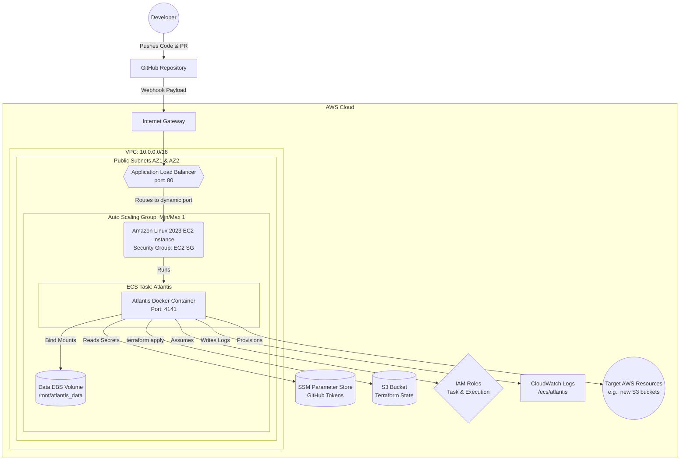

# AWS ECS Atlantis Deployment: End-to-End Guide

This guide provides comprehensive, step-by-step instructions on how to deploy a highly available, production-ready Atlantis environment entirely in AWS utilizing Amazon ECS (EC2 launch type).

By following this guide, you will provision a cloud-native architecture that automatically handles GitHub webhooks securely without relying on local tunnels like Ngrok.

---

## 🏗 System Architecture & Workflow

### 1. High-Level Architecture

This diagram outlines how the AWS infrastructure securely hosts Atlantis.



---

## 🛠 Prerequisites

Before starting, ensure you have:

1. **Terraform** (`>= 1.5.0`) installed locally.
2. **AWS CLI** configured (`aws configure`) with Administrator permissions to deploy networking, IAM, and ECS resources.
3. A **GitHub Personal Access Token (PAT)** with `repo` scope.
4. A **GitHub Webhook Secret** (a random string you create, e.g., run `echo $RANDOM$RANDOM$RANDOM | md5` to get one).

---

## 🔐 Understanding the IAM Roles

Security is paramount. The infrastructure utilizes multiple zero-trust IAM roles to separate concerns:

1. **EC2 Instance Profile (`atlantis-ecs-instance-role`)**:
   - Attached directly to the underlying EC2 server.
   - Allows the server to register itself with the ECS Cluster (`AmazonEC2ContainerServiceforEC2Role`).
2. **ECS Task Execution Role (`atlantis-ecs-task-exec-role`)**:
   - Used by the AWS ECS agent itself (not Atlantis).
   - Allows ECS to pull the public Docker image and, crucially, **read your secure tokens from Systems Manager (SSM)** (`ssm:GetParameters`).
3. **ECS Task Role (`atlantis-ecs-task-role`)**:
   - The role assumed by the running Atlantis Docker container itself.
   - **This is where you attach permissions for Terraform to build things.** Currently, it has `AmazonS3FullAccess` to create demo buckets. In a real environment, you attach your deployment policies here!

---

## 🚀 Step-by-Step Deployment Instructions

### Step 1: Initialize the Infrastructure

Navigate to the `ecs-atlantis-deploy` folder where all the Terraform files are located.

```bash
cd ecs-atlantis-deploy
terraform init
```

### Step 2: Provision the AWS Environment

Execute the apply command. You must provide your GitHub username and the exact repository it is allowed to run against.

```bash
terraform apply \
  -var="github_user=YourGitHubUsername" \
  -var="github_repo_allowlist=github.com/YourGitHubUsername/terraform-atlantis"
```

_(Example: `-var="github_user=rajarammohan0203" -var="github_repo_allowlist=github.com/rajarammohan0203/terraform-atlantis"`)_

Type `yes` when prompted. Wait 3-5 minutes for the VPC, ALB, ASG, and ECS Cluster to deploy.

**CRITICAL:** When it finishes, copy the `atlantis_url` output at the very end of your terminal (e.g., `http://atlantis-alb-xxxxxx.ap-south-1.elb.amazonaws.com`).

### Step 3: Inject Secrets Securely into SSM

To prevent your GitHub Token from being checked into git or printed in Terraform state logs, the code creates "dummy" secrets. You must manually override them with real values directly into AWS Systems Manager Parameter Store.

Run these exact CLI commands (replace `<YOUR_ACTUAL_TOKEN>` and `<YOUR_WEBHOOK_SECRET>`):

```bash
aws ssm put-parameter \
  --name "/atlantis/github_token" \
  --value "<YOUR_ACTUAL_TOKEN_ghp_xxxxxxxx>" \
  --type "SecureString" \
  --overwrite

aws ssm put-parameter \
  --name "/atlantis/webhook_secret" \
  --value "<YOUR_WEBHOOK_SECRET_xxxxxxx>" \
  --type "SecureString" \
  --overwrite
```

### Step 4: Restart the ECS Task to Load the Secrets

Because the ECS task booted _before_ you put the real secrets in, it is currently holding the fake dummy tokens. Force ECS to restart the container so it pulls the real ones:

```bash
aws ecs update-service \
  --cluster atlantis-cluster \
  --service atlantis-service \
  --force-new-deployment \
  --region ap-south-1
```

Wait about 2 minutes for the new task to boot up inside your EC2 instance.

### Step 5: Configure the GitHub Webhook

Atlantis is now running in AWS. We need to tell GitHub where to send the events.

1. Go to your GitHub Repository -> Settings -> **Webhooks**.
2. Click **Add webhook** (or edit your existing Ngrok one).
3. **Payload URL**: Paste the `atlantis_url` from Step 2, and append `/events` to it.
   _(Example: `http://atlantis-alb-xxxxxx.ap-south-1.elb.amazonaws.com/events`)_
4. **Content type**: `application/json`
5. **Secret**: Paste the same exact webhook secret you injected in Step 3.
6. **Events**: Select **Let me select individual events**:
   - Pull requests
   - Pull request reviews
   - Issue comments
   - Pushes
7. Click **Update/Add Webhook**.

---

## ✅ Verification: Testing the End-to-End Flow

To confirm your production-grade ECS Atlantis is functioning flawlessly:

1. **Verify Webhook Delivery**:
   - On GitHub, go to your Webhook settings.
   - Look at the **Recent Deliveries** tab at the bottom.
   - Click the most recent Ping event. It should have a green checkmark indicating your AWS Application Load Balancer successfully received the traffic.
2. **Trigger a Plan**:
   - Open a Pull Request in your repository (or comment `atlantis plan` on an existing open PR).
   - Within 5-10 seconds, the AWS-hosted Atlantis should post a comment containing the Terraform plan.
3. **Verify the Logs (Optional)**:
   - Go to your AWS Console -> **CloudWatch** -> Log groups.
   - Click into `/ecs/atlantis`.
   - You will see the live console logs emitted directly from your Atlantis container as it reads your GitHub comments and executes Terraform!
