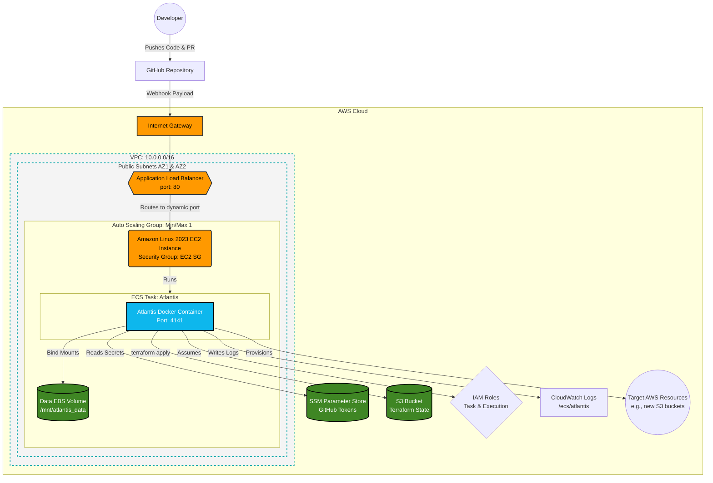
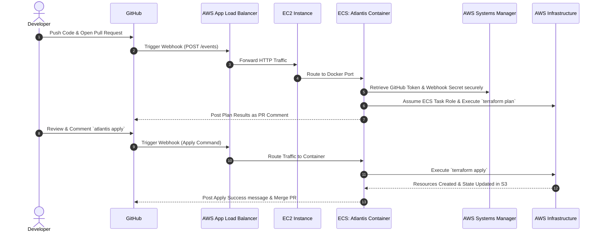

# AWS ECS Atlantis Deployment: Complete End-to-End System Design & Workflow

This document provides a comprehensive overview of how Atlantis was architected, designed, and deployed into an AWS Elastic Container Service (ECS) environment. It covers the core system design, how Atlantis functions, architecture diagrams, and the step-by-step workflow of the implementation.

---

## 1. How Atlantis Works

Atlantis is an application for automating Terraform via pull requests. It serves as a webhook listener for your version control system (GitHub, GitLab, Bitbucket).

**Core Mechanics:**

1. **Webhook Interception:** Atlantis listens for HTTP webhook events from GitHub whenever a Pull Request is opened, updated, or commented on.
2. **Automated Planning:** When a PR containing Terraform code is detected, Atlantis automatically runs `terraform plan` and comments the output directly back to the GitHub PR.
3. **Collaborative Review:** Your team reviews the infrastructure plan directly in GitHub.
4. **Automated Apply:** Instead of running Terraform on local laptops, an authorized user comments `atlantis apply` on the pull request.
5. **Infrastructure Provisioning:** Atlantis reads the comment, executes `terraform apply` against the target cloud provider, posts the success logs, and optionally merges the PR.

---

## 2. System Design & AWS Architecture

Instead of running Atlantis locally using Ngrok (which is not secure or scalable), we designed a robust, production-grade AWS environment.

### 2.1 Design Decisions

- **Compute Layer:** Amazon ECS (Elastic Container Service) using the **EC2 Launch Type** instead of Fargate. This was chosen specifically because Atlantis requires highly persistent workspaces across restarts, which is easiest to achieve by attach EBS (Elastic Block Store) volumes directly to the underlying EC2 host.
- **Networking Layer:** An Application Load Balancer (ALB) is exposed to the public internet to receive webhooks from GitHub. The ALB automatically routes traffic (port 80) to the dynamic port of the Atlantis Docker container running on the EC2 instance in a public subnet.
- **Security & Secrets:** GitHub Personal Access Tokens and Webhook secrets are **never** stored in plaintext code. They are stored in AWS Systems Manager (SSM) Parameter Store. The ECS Task uses native IAM roles to fetch these secrets securely at boot time.
- **State Management:** Terraform state for both the Atlantis infrastructure and the demo S3 buckets is stored securely in remote AWS S3 buckets to prevent state corruption.

### 2.2 AWS Architecture Diagram

---

## 3. Atlantis Automated Workflow Diagram

This sequence diagram breaks down the end-to-end request lifecycle when a developer interacts with the repository and how the AWS infrastructure responds.

---

## 4. End-to-End Steps to Achieve This Setup

Here is exactly what we did to build this AWS-hosted Atlantis environment from scratch.

### Phase 1: Local Docker Testing (The Prototype)

Before touching AWS, we validated the Atlantis configuration locally:

1. Created a dedicated AWS IAM user (`atlantis`) with `AdministratorAccess` locally on the laptop.
2. Created a GitHub Personal Access Token and Webhook HMAC Secret.
3. Used **Ngrok** to create a public URL tunnel routing to `localhost:4141`.
4. Configured the GitHub Webhook to hit the Ngrok URL.
5. Booted the `runatlantis/atlantis` Docker image locally, passing in the AWS credentials via volume mounts (`-v ~/.aws`).
6. Successfully tested `atlantis plan` and `atlantis apply` by provisioning a demo S3 bucket (`s3-demo/main.tf`).

### Phase 2: AWS Infrastructure as Code (`ecs-atlantis-deploy/`)

Once local testing worked, we transitioned to AWS ECS using Terraform.

1. **Networking (`network.tf`)**: We created a dedicated VPC (10.0.0.0/16) with two public subnets spanning multiple Availability Zones. We attached an Internet Gateway and provisions an Application Load Balancer to accept webhooks.
2. **Identity (`iam.tf`)**: We established least-privilege zero-trust roles:
   - _Instance Role_: To let the EC2 machine join the ECS cluster.
   - _Task Execution Role_: To let ECS pull the Docker image and read SSM parameters.
   - _Task Role_: The role Atlantis assumes to actually run Terraform plans/applies (`AmazonS3FullAccess` for the demo).
3. **Secrets (`secrets.tf`)**: We provisioned secure string parameters in AWS SSM for the GitHub tokens.
4. **Compute (`compute.tf`)**: We created an Auto Scaling Group and an EC2 Launch Template (`Amazon Linux 2023`).
   - _Crucial Fix_: We explicitly associated public IP addresses to the ENI so the EC2 instance could fetch the ECS agent and join the cluster.
   - We utilized **EC2 User Data** (`#!/bin/bash`) to automatically format an attached EBS volume (`mkfs -t xfs`) and mount it to `/mnt/atlantis_data`.
5. **Orchestration (`ecs.tf`)**: We defined the ECS Cluster, the Task Definition, and the Service. We bind-mounted `/mnt/atlantis_data` from the EC2 host directly into the container as `/home/atlantis/.atlantis` to ensure Terraform locks and histories persist between container restarts.

### Phase 3: Final Provisioning and Webhook Cutover

1. We initialized the new infrastructure: `terraform init` and `terraform apply`.
2. Terraform outputted the new public AWS ALB DNS Name.
3. We manually updated the AWS SSM parameters via the AWS CLI with our _real_ GitHub Token and Webhook secret, keeping them out of git history.
4. We forced the ECS service to restart so it absorbed the real credentials: `aws ecs update-service --force-new-deployment`.
5. We updated the GitHub Webhook settings to point away from Ngrok and over to the new AWS ALB URL: `http://<ALB-DNS-NAME>/events`.
6. We tested the setup by opening a new PR, modifying `s3-demo/main.tf`, and observing AWS Atlantis successfully execute `atlantis apply`.

### Phase 4: Self-Management Upgrade

1. We added a `.gitignore` file to ensure the local `.terraform` state directories and lock files were completely ignored by Git.
2. We updated `atlantis.yaml` at the root of the repository to track the `ecs-atlantis-deploy` directory.
3. **Outcome:** Moving forward, any changes to the core AWS architecture (like adding SSL, adding a database, or modifying the VPC) can be made via Pull Request, and Atlantis will update _itself_ and its own infrastructure.
