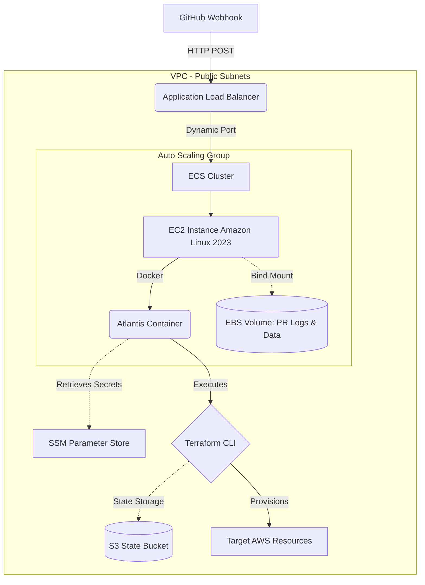
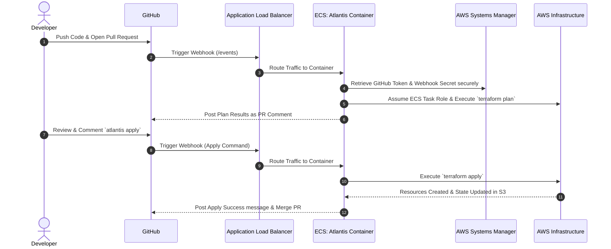

# Atlantis AWS ECS Deployment

This directory contains the Terraform infrastructure code to deploy a highly available, production-ready Atlantis environment on AWS ECS using EC2 instances.

## System Architecture & Workflow

### 1. High-Level Architecture

This diagram outlines how the AWS infrastructure components connect to securely host Atlantis.



### 2. Step-by-Step Workflow

This sequence diagram breaks down the end-to-end request lifecycle when a developer interacts with the repository.



### Architecture Highlights

- **ALB**: Publicly accessible Load Balancer (`http`).
- **ASG + EC2**: Auto Scaling Group managing Amazon Linux 2023 instances.
- **Persistent Storage**: A dedicated EBS volume dynamically formatted and mounted via EC2 User Data to persist PR logs/workspaces across container restarts.
- **SSM Parameters**: Secure storage for your GitHub Token and Webhook Secret (never stored in plaintext state).
- **Dynamic Port Mapping**: Handled automatically by ECS bridging with ALB target groups.

## Deployment Instructions

### 1. Initialize and Apply

Review `variables.tf` and provide the required variables during apply:

```bash
terraform init
terraform apply -var="github_user=rajarammohan0203" -var="github_repo_allowlist=github.com/rajarammohan0203/terraform-atlantis"
```

_(Note: It will output an `atlantis_url` at the end. Copy this!)_

### 2. Set the Secrets

For security, Terraform created dummy parameters in AWS Systems Manager (SSM) because committing secrets tracking in state is dangerous. You need to update them with the real values.
Run the following commands using the AWS CLI, replacing the `<...>` with your actual values:

```bash
aws ssm put-parameter --name "/atlantis/github_token" \
  --value "ghp_YOUR_ACTUAL_TOKEN" \
  --type "SecureString" --overwrite

aws ssm put-parameter --name "/atlantis/webhook_secret" \
  --value "YOUR_WEBHOOK_SECRET" \
  --type "SecureString" --overwrite
```

### 3. Restart the ECS Task

Because the task initially booted with dummy secrets, you must force ECS to cycle the container to inject the newly updated secrets:

```bash
aws ecs update-service --cluster atlantis-cluster \
  --service atlantis-service \
  --force-new-deployment \
  --region ap-south-1
```

### 4. Update GitHub Webhook

1. Go to your GitHub repository **Settings > Webhooks**.
2. Edit your existing webhook (or create a new one).
3. Change the **Payload URL** from your old Ngrok URL to the new ALB URL outputted from Terraform:
   `http://<YOUR_ALB_DNS_NAME>/events`
4. Ensure the Content type is `application/json` and the Secret matches what you put in SSM.
5. Save.

Your robust AWS deployment of Atlantis is now live!
